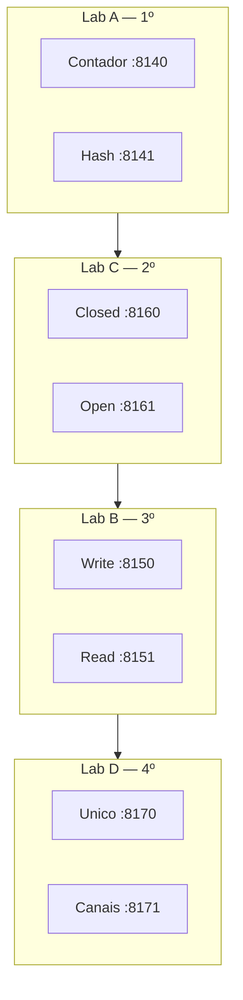

# 11 — System Design (desenho ponta a ponta)

**Conceito central:** conduzir um **desenho de sistema** — escopo, envelope, diagrama, deep dive e falhas — como numa entrevista de big tech, usando o que a trilha já ensinou.  
**Domínio âncora:** casos clássicos (encurtador, feed, chat, vídeo) — **não** o portal; a ponte é o **mecanismo** (cache, fila, blob…), não o domínio. Ver [teoria.md](teoria.md) (“Por que casos clássicos”).  
**Stack:** Python 3 · Docker Compose · Redis

> **Contrato com o [10](../10-arquitetura/):** lá você escolhe *estilo* (monólito, fila, serviços). Aqui você **compõe um produto** sob restrição de tempo (45 min) e justifica cada caixa.

Pré-requisitos: [00 — Ambiente Docker](../00-ambiente-docker/). Mínimo: [05](../05-escalabilidade/) · [07](../07-cache-distribuido/) · [10](../10-arquitetura/). Completo: 01–10.  
Apoio: [glossario.md](glossario.md) · [troubleshooting.md](troubleshooting.md) · modelos falados: [exemplo-encurtador.md](exemplo-encurtador.md) · [exemplo-notificacao.md](exemplo-notificacao.md)

> **Gabarito:** [decisoes-gabarito.md](decisoes-gabarito.md) — só **depois** de [decisoes.md](decisoes.md).  
> **Mocks:** [mock-entrevista.md](mock-entrevista.md) — **Notification** (mínimo) e **YouTube** (completo); Chat = ficha + Mock opcional.

> **Ordem canônica dos labs:** **A → C → B → D** (leitura → abuso do POST → celebridade → async multi-canal).  
> **Ordem do envelope:** na 1ª passagem faça só a **folha em branco** ([teoria.md](teoria.md) §3.5). O [exemplo-encurtador.md](exemplo-encurtador.md) fica **logo depois** do lab A (idealmente no dia seguinte).  
> **Ordem do Mock 1:** lab D + ficha + cenário 3 → mock → **só então** [exemplo-notificacao.md](exemplo-notificacao.md).  
> **Carga:** bloco final (~12–14 h mínimo / ~22–26 h completo). Não é um lab de 2 h.

---

## Objetivos de aprendizado

1. **Conduzir** os 4 passos de uma entrevista de system design (escopo → high-level → deep dive → wrap-up).
2. **Estimar** ordem de grandeza (QPS, storage, #máquinas) sem calculadora mágica — e declarar premissas.
3. **Mapear** building blocks (LB, cache, fila, shard, CDN…) aos módulos 01–10.
4. **Desenhar** no quadro: caixas, sync vs async, QPS nas arestas.
5. **Observar** gargalo de **leitura** no encurtador (store vs cache; 301 vs 302; colisão de hash) — lab A.  
6. **Observar** rate limit e **fail-open vs fail-closed** (janela fixa) — lab C.  
7. **Observar** fan-out **on write vs on read** (celebridade; worker parado) — lab B.  
8. **Observar** filas **por canal** vs fila única (e-mail não segura push) — lab D.  
9. **Deep dive** em componentes clássicos: unique IDs, consistent hashing, mídia/storage, chat.  
10. **Sustentar** 45 min de mock (**Notification** e, no completo, **YouTube**) falando de falha, consistência e 10× escala.

> Meta: *“Dado um produto e um SLA, qual arquitetura cabe — e o que eu pago em escala, consistência e falha?”*

---

## Caminhos de estudo

### Caminho mínimo (~12–14 h; +20–30 min na 1ª build)

Fecha objetivos **1–8** e **10** (parcial: só Mock 1). Ordem = arco canônico **A → C → B → D**.

1. [teoria.md](teoria.md) **§1–4** (~50 min) — framework, envelope, building blocks  
2. [teoria.md](teoria.md) **§5–6** (~20 min) — desenhar no quadro; perguntas do entrevistador  
3. Folha §3.5 ([teoria.md](teoria.md)) — **sem** abrir o modelo (~15 min)  
4. [tutorial-url-shortener.md](tutorial-url-shortener.md) (Partes A–C) — lab A  
5. [exemplo-encurtador.md](exemplo-encurtador.md) — **logo depois** do lab A (~20 min)  
6. [tutorial-rate-limiter.md](tutorial-rate-limiter.md) — lab C (janela fixa + fail policy)  
7. [casos-entrevista.md](casos-entrevista.md) — ficha **News feed** (antes do lab B)  
8. [tutorial-feed-fanout.md](tutorial-feed-fanout.md) (Partes A–C) — lab B  
9. [tutorial-notificacao-canais.md](tutorial-notificacao-canais.md) — lab D  
10. [decisoes.md](decisoes.md) — cenários **1**, **2**, **3** e **6**  
11. [mock-entrevista.md](mock-entrevista.md) — **Mock 1 (Notification)** (sem abrir o modelo)  
12. [exemplo-notificacao.md](exemplo-notificacao.md) — compare **depois** do mock (~15 min)  
13. Checklist **mínimo** abaixo  

**Pré-requisitos no host:** `curl`, `python3`, `xargs`, Docker Compose ([00](../00-ambiente-docker/)).

### Caminho completo (~22–26 h) — recomendado

Mesma ordem de labs (**A → C → B → D**), com fichas e Mock 2.

| Ordem | Material | Tempo | Para quê |
|-------|----------|-------|----------|
| 1 | [teoria.md](teoria.md) | ~1,5–2 h | Framework + envelope + mapa 01–10 |
| 2 | [tutorial-url-shortener.md](tutorial-url-shortener.md) + [exemplo-encurtador.md](exemplo-encurtador.md) | ~3 h | Leitura pesada, IDs, cache |
| 3 | [tutorial-rate-limiter.md](tutorial-rate-limiter.md) | ~1,5 h | Janela fixa; fail-open/closed |
| 4 | [tutorial-feed-fanout.md](tutorial-feed-fanout.md) | ~3 h | Celebridade; write vs read; híbrido |
| 5 | [tutorial-notificacao-canais.md](tutorial-notificacao-canais.md) | ~1,5 h | Filas por canal |
| 6 | [casos-entrevista.md](casos-entrevista.md) — IDs, hashing (+ exercício papel), YouTube, Drive, Chat | ~2,5–3 h | Deep dives restantes |
| 7 | [decisoes.md](decisoes.md) + síntese | ~2 h | Seis prompts + 1 página |
| 8 | Mock 1 + [exemplo-notificacao.md](exemplo-notificacao.md) | ~1,5–2 h | Notification |
| 9 | Mock 2 YouTube | ~1,5 h | Upload vs watch (**sem lab Compose** — evidência = [08](../08-armazenamento-arquivos/) + ficha) |
| 10 | Mock Chat (opcional) + [tecnologias-e-escolhas.md](tecnologias-e-escolhas.md) | ~1–2 h | Tempo real; cola |

Cada tutorial: Parte **tecnologia** → Parte **contexto** → Parte **lab** (não confundir com Labs A–D).

---

## Arco narrativo

1. **Dor** — “desenha um Twitter” e o candidato lista Kafka sem perguntar QPS.  
2. **Mapa** — 4 passos, envelope do encurtador, building blocks = 01–10.  
3. **Lab A** — IDs; cache na leitura; 301 vs 302; colisão; Redis down; idempotência.  
4. **Lab C** — abuso do POST: cota 429; Redis down → fail-open vs fail-closed.  
5. **Lab B** — fan-out write vs read; celebridade; worker down.  
6. **Lab D** — notificação: fila única vs por canal.  
7. **Fichas** — IDs, hashing, YouTube, Drive, Chat.  
8. **Fechamento** — [decisoes.md](decisoes.md) + mocks.

Os labs são **Compose separados**:



---

## Mapa dos 4 labs

| Lab | Pergunta central | Objetivos |
|-----|------------------|-----------|
| [lab-url-shortener](lab-url-shortener/) | Na leitura, o gargalo é o hash, o banco ou o cache? | 2, 3, 5 |
| [lab-rate-limiter](lab-rate-limiter/) | Redis caiu: deixa passar ou 503? | 3, 6 |
| [lab-feed-fanout](lab-feed-fanout/) | O que quebra quando 1 celebridade posta para N seguidores? | 3, 4, 7 |
| [lab-notificacao-canais](lab-notificacao-canais/) | E-mail lento segura o push? | 3, 8, 10 |

**Um lab por vez.** `docker compose down -v` antes de trocar. Ver [troubleshooting.md](troubleshooting.md).

```bash
cd sistemas-distribuidos/11-system-design/lab-url-shortener && ./scripts/up.sh
# … depois, na ordem canônica (um Compose por vez):
cd ../lab-rate-limiter && ./scripts/up.sh
cd ../lab-feed-fanout && ./scripts/up.sh
cd ../lab-notificacao-canais && ./scripts/up.sh
```

| Lab | Portas | Ideia |
|-----|--------|-------|
| **A** | `8140` / `8141` · Redis `6392` | Cache; colisão; 301/302 |
| **B** | `8150` / `8151` · Redis `6393` | Fan-out write vs read |
| **C** | `8160` / `8161` · Redis `6394` | Janela fixa; 429; fail-open/closed |
| **D** | `8170` / `8171` · Redis `6395` | Fila única vs por canal |

---

## Checklist — pronto?

### Mínimo

- [ ] Conduzo os 4 passos e digo o que *não* entra no escopo de 45 min.  
- [ ] Rederivo QPS/storage do encurtador (teoria §3); distingo working set vs URLs/dia.  
- [ ] Sei apontar 5 building blocks e o módulo da trilha onde já os vi.  
- [ ] Lab A: cache ≪ store; 301 vs 302; colisão; Redis down.  
- [ ] Lab B: celebridade no write; leitor no read; híbrido em números.  
- [ ] Lab C: 429 após cota; closed→503 e open→200 com Redis down; sei que o lab é **janela fixa**.  
- [ ] Lab D: push no unico ≫ push nos canais; sei que idempotência no Mock 1 é quadro/[06], não o Compose.  
- [ ] Mock 1: canais/idempotência *antes* de SMTP na borda.  
- [ ] Folha §3.5 antes do modelo do encurtador; modelo Notification **depois** do mock.

### Completo

- [ ] Fichas: IDs (exercício papel), hashing, YouTube, Drive, Chat.  
- [ ] Lab B: worker parado → inbox fria.  
- [ ] Seis cenários + **síntese** em [decisoes.md](decisoes.md).  
- [ ] Mock 2 (YouTube): upload vs watch; blob ≠ metadado; CDN em 90 s — **sem lab Compose** (evidência 08 + ficha).  
- [ ] (Opcional) Mock Chat.

---

## Ponte com outros módulos

| De onde veio | Para onde vai |
|--------------|---------------|
| [05](../05-escalabilidade/) / [07](../07-cache-distribuido/) | Camada certa + cache na leitura (lab A) |
| [01](../01-comunicacao/) / [10](../10-arquitetura/) | Fila, fan-out, EDA (labs B e D) |
| [02](../02-replicacao/) / [03](../03-consistencia-cap/) | Réplica, consistência no wrap-up |
| [04](../04-coordenacao-locks/) / [06](../06-falhas-timeout/) | IDs, rate limit (lab C), retry/idempotência |
| [08](../08-armazenamento-arquivos/) / [09](../09-observabilidade/) | Blob vs metadado; o que medir no mock |
| [10](../10-arquitetura/) | Estilo; este módulo **compõe o produto** |

---

## Bibliografia (`books/`)

| Fonte | Uso neste módulo |
|-------|------------------|
| Alex Xu, *System Design Interview* Vol. 1 | Framework 4 passos, envelope, casos (esqueleto — texto aqui é original) |
| Xu & Lam, *System Design Interview* Vol. 2 | Apêndice “próximo nível” (sem aula) |
| Richards & Ford, *Fundamentals of Software Architecture* | Trade-off; características de arquitetura |
| Ford et al., *The Hard Parts* | Granularidade, dados, orquestração/coreografia |
| van Steen & Tanenbaum, *Distributed Systems* | Falha parcial, consistência |
| Bellemare, *Building Event-Driven Microservices* | Quando async / fan-out |
| Material da trilha 01–10 | Evidência observável (não slide de ferramenta) |
