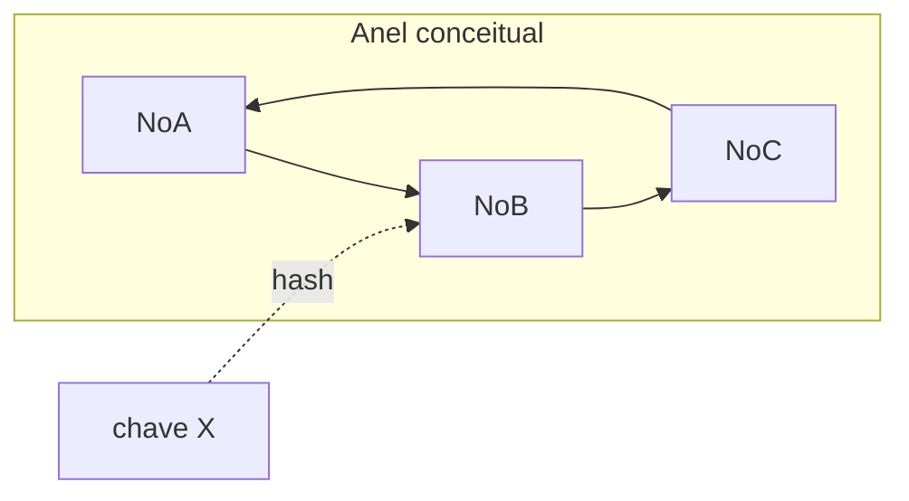
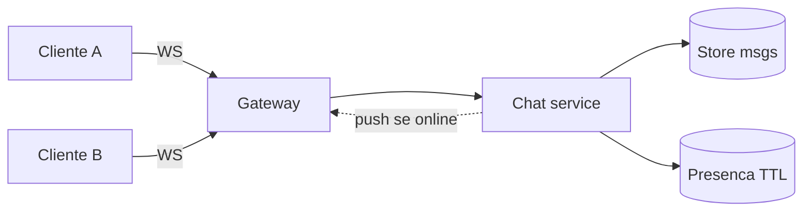

# Fichas de entrevista — casos clássicos

**Módulo:** [11 — System Design](README.md)  
**Faça depois** da [teoria](teoria.md). Labs A–D cobrem encurtador, feed, rate limiter e filas por canal. As fichas restantes (IDs, hashing, YouTube, Drive, Chat) são **quadro**.

**Domínio:** produtos **clássicos de entrevista** (encurtador, feed, chat, vídeo…). Quando citar o portal, é só **analogia** à trilha 01–10 — não misture os enunciados.

Cada ficha: 4 passos + caixa **Ponte 01–10** + 2 armadilhas. Não há desenho único.

---

## Como usar uma ficha

1. **Sem espiar a “Direção”:** dobre a página ou cubra com a mão; 10–15 min no papel só com enunciado + perguntas.  
2. Compare com a direção — se pulou o passo 1, recomece.  
3. Na sala, um aluno entrevista o outro com as perguntas de esclarecimento.

---

## 1. Rate limiter (borda de API)

**Enunciado:** “Desenhe um rate limiter para a API pública.”

> **Lab C:** [lab-rate-limiter/](lab-rate-limiter/) — **janela fixa** (`INCR`+TTL), cota **429**, Redis down fail-open vs fail-closed (**503**/**200**). Tutorial: [tutorial-rate-limiter.md](tutorial-rate-limiter.md).  
> Na oral, nomeie alternativas: **token bucket** / **sliding window** (não implementadas no lab).

**Perguntas (passo 1):** Por IP, por token ou por rota? Limite médio ou pico curto? O que acontece se o Redis cair — **fail-open** (deixa passar) ou **fail-closed** (**503**)? Síncrono na borda?

### Direção (não copiar no quadro)

| Passo | Conteúdo |
|-------|----------|
| 1 | Ex.: 100 req/min por token; p99 do check < 5 ms; fail-closed em pagamento, fail-open em feed. |
| 2 | Borda → limiter (Redis) → API. Contador por chave + TTL. Entidades: `Quota(chave, janela, count)`. |
| 3 | **Token bucket** (pico curto ok) vs **sliding window** (mais justo) vs **fixed window** (lab C — simples; *edge burst*). Chave = `token:rota`. |
| 4 | Redis SPOF → réplica / fail policy; 10× chaves = memória; métrica: taxa de 429 vs QPS ([09](../09-observabilidade/)). |

**Ponte 01–10:** lock/contador atômico no [04](../04-coordenacao-locks/); Redis no [07](../07-cache-distribuido/); timeout no [06](../06-falhas-timeout/); **lab C** + lab A `provar-redis-down.sh`.

**Armadilhas**

1. “O load balancer já limita” — LB não conhece *seu* token de API.  
2. Fail-open em tudo — um outage de Redis vira DDoS na origem.

---

## 2. Unique IDs distribuídos

**Enunciado:** “Gere IDs únicos em vários nós, sem UUID gigante na URL.”

> **Só quadro** (+ evidência parcial no lab A: contador vs hash). Sem Compose dedicado.

**Perguntas:** Precisa ser ordenável por tempo? Pode ter furo na sequência? Quantos IDs/s? Multi-DC?

### Direção

| Passo | Conteúdo |
|-------|----------|
| 1 | Ex.: 64 bit, unique global, ~10k/s, ordenação aproximada por tempo ok, furos ok. |
| 2 | Três famílias: **contador** (lab A), **ticket service**, **relógio + worker id** (Snowflake-like). |
| 3 | Contador: simples, SPOF/seq. Tickets: lote na memória, risco de perda no crash. Relógio: cuidado com NTP para trás. |
| 4 | Relógio atrasou → IDs repetidos; 10× nós → bits de worker. |

**Ponte 01–10:** unicidade e lock no [04](../04-coordenacao-locks/); lab A (contador vs hash). Hash truncado **não** é gerador de ID. Contador = **sequencial denso**, não aleatório.

**Armadilhas**

1. UUID na URL curta — tamanho e imprevisibilidade vs UX.  
2. Ignorar relógio: “a gente usa timestamp” sem dizer o que acontece no NTP step.

### Exercício de papel (caminho completo, ~15 min)

Cubra a Direção. No papel: (1) escolha uma família (contador / ticket / Snowflake-like); (2) 1 SPOF; (3) o que acontece se o relógio atrasar 2 s. Compare com a Direção. Rubrica mínima: nomeou família + SPOF + 1 falha de relógio/sequência.

---

## 3. Consistent hashing

**Enunciado:** “Como espalhar chaves em N nós de cache/KV quando N sobe e desce?”

**Perguntas:** O que dói hoje — rehash de 100% das chaves? Hot key? Replicas por chave?

### Direção

| Passo | Conteúdo |
|-------|----------|
| 1 | Objetivo: ao cair 1 nó, **só ~1/N** das chaves remapeiam. |
| 2 | Anel; nós e chaves hasheados; sucessor guarda a chave. **Nós virtuais** para não enviesar. |
| 3 | Hot key não some com hashing — precisa split ou cache local ([05](../05-escalabilidade/)). |
| 4 | Rebalance = tráfego de cópia; hit rate e p99 no nó que sai/entra. |

| `hash(key) % N` | Consistent hashing |
|-----------------|--------------------|
| Ao mudar N, **quase todas** as chaves remapeiam | Ao sair 1 nó, ~**1/N** remapeia |
| Simples | Precisa de anel (+ vnodes) |

**Ponte 01–10:** partição / hot key no [05](../05-escalabilidade/) lab dados. O lab 11 **não** implementa o anel. Em entrevistas, hashing costuma ser deep dive de **cache/KV**, não do feed.

**Armadilhas**

1. Confundir com *hash mod N* (rehash quase total).  
2. Achar que consistent hashing resolve celebridade no feed.

---

## 4. News feed

**Enunciado:** “Desenhe o feed de um app de following.”

**Perguntas:** Só following, ou também “para você”? Ranking? Quantos seguidores no p99? O post precisa aparecer em < 1 s para todos?

### Direção

| Passo | Conteúdo |
|-------|----------|
| 1 | Following; sem ads; eventual de 1–2 s ok; DAU e tamanho médio do grafo. |
| 2 | Entidades: `User`, `Follow`, `Post`, `Inbox`. Post store + grafo + **ou** inbox **ou** merge (lab B). |
| 3 | Celebrity → **híbrido** (tutorial Exp. 4): push comum, pull celebridade. Cache da timeline ([07](../07-cache-distribuido/)). |
| 4 | Worker down (lab B); 10× seguidores; p99 GET; profundidade de fila ([09](../09-observabilidade/)). |

**Ponte 01–10:** fila [01](../01-comunicacao/); escala/hot key [05](../05-escalabilidade/); cache [07](../07-cache-distribuido/); EDA [10](../10-arquitetura/); **lab B**.

**Armadilhas**

1. Só Kafka no slide, sem dizer *quem* consome e *o que* materializa.  
2. Push puro para 50 M de seguidores no request HTTP.

---

## 5. Notification system

**Enunciado:** “Desenhe um sistema de notificações: push mobile, e-mail e SMS para eventos do produto (ex.: ‘pedido confirmado’ / ‘prova recebida’).”

> **Lab D:** [lab-notificacao-canais/](lab-notificacao-canais/) — fila única vs por canal (e-mail não segura push). Tutorial: [tutorial-notificacao-canais.md](tutorial-notificacao-canais.md).  
> Analogia trilha: o `POST` da borda no [10](../10-arquitetura/) lab B — **não** espere SMTP no request.

**Perguntas:** Confirmação na hora? Um canal cai — os outros seguem? Preferências? Idempotência no retry?

### Direção

| Passo | Conteúdo |
|-------|----------|
| 1 | Evento → 3 canais; e-mail pode atrasar; push tenta < 2 s; SMS só urgente. |
| 2 | Publisher → **fila por canal** → gateways. Borda devolve 202. Entidades: `Event`, `NotificationJob`, `Preference`. |
| 3 | Retry + **idempotency key** ([06](../06-falhas-timeout/)); template + preferências; DLQ. |
| 4 | Gateway SMS SPOF; 10× eventos; lag por fila, bounce ([09](../09-observabilidade/)). |

**Ponte 01–10:** [01](../01-comunicacao/) filas; [06](../06-falhas-timeout/); [10](../10-arquitetura/) lab B; **lab D** deste módulo.

**Armadilhas**

1. SMTP síncrono no request da borda.  
2. Um único worker para três canais — SMS lento segura o push.

**Mock 1** usa este caso.

---

## 6. YouTube (watch + upload)

**Enunciado:** “Desenhe um YouTube.” Recorte: upload e reprodução; sem ads, sem live, sem comentários (a menos que o entrevistador peça).

**Perguntas:** QPS de **watch** vs **upload**? Resoluções? On-the-fly vs pré-processado? SLA de “publicado”?

### Direção

| Passo | Conteúdo |
|-------|----------|
| 1 | Watch ≫ upload; processamento **async**; “publicado” com 360p; 1080p depois. |
| 2 | API metadado; **upload direto ao object storage**; fila de transcode; CDN no watch. |
| 3 | Metadado ≠ blob ([08](../08-armazenamento-arquivos/)). CDN tira QPS da origem. |
| 4 | Transcoder caiu → “processando”; 10× watch = CDN/cache; p99 time-to-first-frame ([09](../09-observabilidade/)). |

### Como falar de CDN em 90 segundos (sem lab de PoP)

“CDN é cache **geográfico** na borda: o player busca um URL (muitas vezes via DNS) e o byte sai do PoP perto do usuário. Eu **não** construo o CDN no quadro — assumo um provedor. O que desenho é: origem = object storage + metadado `ready`; cache key = objeto/versão; invalidação quando republish; se o PoP erra, fallback à origem. 10× watch escala **CDN/cache**, não o transcoder.”

Se o entrevistador puxar “e a origem tem muitos nós de cache interno?”: “aí entra **consistent hashing** (ficha 3) para remapar poucas chaves quando um nó de cache sai — não confundir com o CDN.”

**Ponte 01–10:** [08](../08-armazenamento-arquivos/); [05](../05-escalabilidade/) / [07](../07-cache-distribuido/); fila [01](../01-comunicacao/).

**Armadilhas**

1. Upload pelo mesmo processo que serve o player.  
2. MP4 como linha de banco.

**Mock 2** usa este caso. Números do mock são **escala didática**, não YouTube real.

---

## 7. Google Drive (ficha curta — caminho completo)

**Enunciado:** “Desenhe um Drive.” Recorte: upload, download, pastas.

**Perguntas:** Tamanho p95? Dedup? Dois clientes editando? Namespace vs blob?

### Direção

| Passo | Conteúdo |
|-------|----------|
| 1 | Blob no object storage; metadado noutro store; upload resumable. |
| 2 | API metadado → URL pré-assinada → storage ([08](../08-armazenamento-arquivos/)). |
| 3 | Dedup por hash (lab 08); lock/versão ([04](../04-coordenacao-locks/)) se edição. |
| 4 | Conflito de sync = merge ou LWW — diga qual. |

**Armadilhas:** BYTEA de 2 GB; achar que renomear pasta move o blob.

---

## 8. Chat (1:1 + grupos pequenos)

**Enunciado:** “Desenhe um chat em tempo quase real: 1:1 e grupos ≤ 50. Só texto.”

> A trilha **não** tem lab de WebSocket — **de propósito** (carga do módulo).  
> Use o diagrama abaixo + a ficha; o Mock Chat é **opcional**. WS = conexão longa para **empurrar**; a mensagem ainda é **persistida**.

**Perguntas:** Entrega at-least-once? Ordem por conversa? Offline? Presença com que precisão?

### Direção

| Passo | Conteúdo |
|-------|----------|
| 1 | Texto; grupos ≤ 50; presença ~30 s ok; mídia/E2E fora. |
| 2 | Cliente ↔ gateway (WS ou long-poll) → chat service → store de mensagens; presença (Redis TTL) **separada**. |
| 3 | Seq por `conversation_id`; fan-out ≤ 50; sticky LB **ou** pub/sub entre gateways se o peer está noutro nó. |
| 4 | Gateway cai → reconnect; presença stale; métricas: conexões, lag, fila offline. |

**Ponte 01–10:** push [01](../01-comunicacao/); eventual [03](../03-consistencia-cap/); reconnect [06](../06-falhas-timeout/); presença ~ cache [07](../07-cache-distribuido/).

**Armadilhas**

1. Tratar chat como news feed (fan-out de milhões).  
2. Desenhar WS sem store — mensagem some se o peer estava offline.

**Mock opcional** (caminho completo) em [mock-entrevista.md](mock-entrevista.md).

---

## Apêndice — Vol. 2 e o que não cabe neste módulo

| Caso | Por que fica para depois |
|------|--------------------------|
| Proximity / nearby / Maps | Geo-índice — não praticado na trilha |
| Distributed message queue | *Usar* fila ≠ *construir* Kafka |
| Metrics / ad click aggregation | Pipelines; [09](../09-observabilidade/) como consumidor |
| Hotel reservation | Reforço do [04](../04-coordenacao-locks/) |
| S3-like storage | Aprofundamento do [08](../08-armazenamento-arquivos/) |
| Leaderboard / Payment / Exchange | Rank / ledger — fora do recorte ADS |

Crawler e autocomplete (Vol. 1): exercícios caseiros depois dos mocks.
