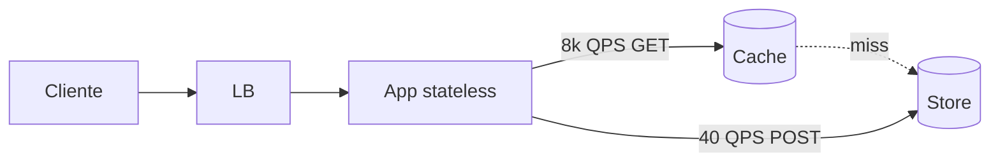

# Teoria — System Design

**Módulo:** [11 — System Design](README.md)  
**Leitura:** ~1,5–2 h · depois vá ao lab A  
**Modelo falado:** [exemplo-encurtador.md](exemplo-encurtador.md) (depois de §2–3)

> System design aqui = **conversa de trade-off sob relógio**, não catálogo de marcas.  
> **10 escolhe o estilo**; **este módulo desenha o produto** (escopo, números, gargalo, falha).

### Por que casos clássicos (e não o portal)?

Nos módulos **01–10** o domínio âncora foi o **portal acadêmico** — bom para *ver* fila, réplica, cache, falha.  
Nas **entrevistas** de big tech o enunciado costuma ser outro: encurtador, feed, chat, vídeo.

A ponte **não** é o domínio. É o **mecanismo**:

| No portal você viu… | Na entrevista vira… |
|---------------------|---------------------|
| Cache no boletim ([07](../07-cache-distribuido/)) | Cache no GET do redirect |
| Fila no prazo ([01](../01-comunicacao/), [10](../10-arquitetura/)) | Notificação / fan-out async |
| Object storage ([08](../08-armazenamento-arquivos/)) | Blob do vídeo ≠ metadado |
| Gargalo móvel ([05](../05-escalabilidade/)) | “10× QPS — o que explode?” |

Você já tem as peças. Este módulo ensina a **montar o produto sob relógio**.

### Sumário — 1 linha por ideia

| Ideia | Em uma frase |
|-------|----------------|
| **Passo 1** | Esclarecer o que entra / o que fica de fora; anotar SLA. |
| **Passo 2** | Diagrama alto nível + **entidades/API** + buy-in. |
| **Passo 3** | Deep dive em **1–2** gargalos, não em tudo. |
| **Passo 4** | Wrap-up: SPOF, 10× carga, consistência, o que medir. |
| **Envelope** | QPS, storage, #máquinas — ordem de grandeza, premissas à mostra. |
| **Building block** | Peça que você já viu na trilha (LB, cache, fila, shard…). |

---

## 1. Entrevista ≠ lista de ferramentas

O entrevistador não quer a arquitetura “certa” do Twitter. Quer ver se você:

1. **Pergunta** antes de desenhar (carga, consistência, clientes).  
2. **Compõe** blocos com custo explícito (taxa distribuída do [10](../10-arquitetura/)).  
3. **Aprofunda** o gargalo que o problema pede — e admite o que não cabe em 45 min.  
4. **Fecha** falando de falha parcial ([06](../06-falhas-timeout/)) e de como saberia que quebrou ([09](../09-observabilidade/)).

### Anti-exemplo (90 segundos ruins)

> Entrevistador: “Desenhe um encurtador.”  
> Candidato: “A gente sobe Kubernetes, Kafka, Cassandra multi-DC e um service mesh…”

O que faltou: **uma pergunta de carga**, **um número**, **o caminho feliz do GET**.  
Correção: “Antes do desenho — quantas URLs novas/dia e qual a razão leitura:escrita?”

Candidato fraco: “coloca Kubernetes, Kafka e Cassandra”.  
Candidato forte: “são 4k reads/s e 40 writes/s; o POST pode ser eventual; o GET do redirect precisa de p99 baixo — então cache na leitura, não fila na escrita.”

Isso é o mesmo critério do workshop do 10, agora aplicado a **produtos clássicos de entrevista**.

---

## 2. Framework de 4 passos (45 min)

Tempos são orçamento, não cronômetro sagrado. Se o passo 1 comer 15 min, o deep dive encolhe — e tudo bem, **desde que o escopo esteja claro**.

| Passo | Tempo | O que fazer | O que não fazer |
|-------|-------|-------------|-----------------|
| **1. Escopo** | 3–10 min | Requisitos funcionais e não-funcionais; 3–5 perguntas; recorte | Desenhar na primeira frase |
| **2. High-level** | 10–15 min | Caixas + dados; **buy-in** (“está ok seguir por aqui?”) | Micro-otimizar um hop |
| **3. Deep dive** | 10–25 min | 1–2 gargalos (ex.: fan-out da celebridade; ID do encurtador) | Explicar todas as caixas |
| **4. Wrap-up** | 3–5 min | SPOF, 10×, consistência, métricas | Novo produto inteiro |

### Passo 1 — perguntas que quase sempre pagam

- **Quem** usa? Web, mobile, API interna, terceiros?  
- **Escala:** DAU, QPS leitura vs escrita, tamanho do objeto, crescimento em 1 ano / 5 anos.  
- **Latência:** o quê precisa ser síncrono na borda? ([10](../10-arquitetura/) lab B)  
- **Consistência:** o feed pode atrasar 2 s? O saldo não. ([03](../03-consistencia-cap/))  
- **Fora de escopo:** login, billing, app iOS, ML de ranking — diga em voz alta.

Anote no canto do quadro: `reads ≫ writes` · `p99 GET < 200 ms` · `eventual no feed`.

### Passo 2 — buy-in + esqueleto de dados

Desenhe o caminho feliz **uma vez**. Peça confirmação. Se o entrevistador puxar um detalhe (“e o upload?”), **não** comece o passo 3 em silêncio: “posso detalhar storage depois; primeiro o watch path, ok?”

Antes de sair do passo 2, gaste **2–5 min** neste template (escreva no canto do quadro):

```text
Entidades (3–5):  _______________________________
Chaves / IDs:     _______________________________
Endpoints (2–4):  POST …   GET …
Sync vs async:    o que espera resposta na borda?
```

Exemplo (encurtador): entidades `Url(codigo, destino, created_at)`; `POST /encurtar`, `GET /r/{codigo}`; GET sync, analytics async (fora).

### Passo 3 — um gargalo

Escolha o que **muda o desenho**:

| Produto | Deep dive típico |
|---------|------------------|
| Encurtador | Geração de ID + cache do GET |
| Feed | Fan-out write vs read |
| Chat | Entrega / ordem / presença |
| Vídeo | Upload async vs CDN no watch |

### Passo 4 — checklist de fechamento

- 1 SPOF nomeado e como tirar (réplica [02](../02-replicacao/), mais de um hop).  
- O que acontece em **10×** QPS (qual camada estoura — [05](../05-escalabilidade/)).  
- Consistência: o que pode atrasar.  
- Timeout / retry / idempotência ([06](../06-falhas-timeout/)).  
- O que você olharia no Grafana ([09](../09-observabilidade/)): QPS, p99, taxa de 5xx, profundidade de fila.

---

## 3. Envelope (back-of-the-envelope)

Objetivo: **ordem de grandeza**, não três casas decimais. Arredonde. Escreva a premissa. Rotule a unidade.

### 3.1 Potências (cola)

| Aproximação | Bytes |
|-------------|-------|
| \(10^3 \approx 2^{10}\) | 1 KB |
| \(10^6 \approx 2^{20}\) | 1 MB |
| \(10^9 \approx 2^{30}\) | 1 GB |
| \(10^{12} \approx 2^{40}\) | 1 TB |

### 3.2 Latência — ordem de grandeza

Não decore uma tabela de produto. Lembre a **escada**:

| Onde | Ordem |
|------|--------|
| Registrador / L1 | ns |
| DRAM | ~100 ns |
| SSD (aleatório) | ~100 µs |
| Disco mecânico / seek | ~10 ms |
| RTT mesmo DC | < 1 ms |
| RTT intercontinental | ~100 ms |

Implicação: **não busque no disco por request** se puder cache ([07](../07-cache-distribuido/)); **não faça N RTTs síncronos** na borda se o aluno só precisa de recibo ([10](../10-arquitetura/) lab B).

### 3.3 Disponibilidade (“nines”)

| SLA | Downtime ≈ / ano |
|-----|------------------|
| 99% | ~3,65 dias |
| 99,9% | ~8,8 h |
| 99,99% | ~52 min |

Na entrevista: “3 nines na API pública” ≠ “nunca cai o worker de thumbnail”. Separe **borda** e **assíncrono**.

### 3.4 Exemplo trabalhado — encurtador (rederive, não decore)

Premissas **nossas** (mude-as se o entrevistador der outros números):

- **100 milhões** de URLs **novas por mês**.  
- Leitura : escrita = **100 : 1**.  
- Pico = **2×** a média.  
- Registro ≈ **130 B** (URL + código + metadado enxuto).  
- Horizonte de storage: **5 anos**.

Segundos num mês ≈ \(30 \times 24 \times 3600 = 2\,592\,000\).

\[
\text{QPS escrita} \approx \frac{10^8}{2{,}592 \times 10^6} \approx 39 \;\rightarrow\; \mathbf{40/s}
\]

Pico escrita ≈ **80/s**.  
QPS leitura ≈ \(40 \times 100 = \mathbf{4\,000/s}\); pico ≈ **8\,000/s**.

Registros em 5 anos: \(10^8 \times 12 \times 5 = 6 \times 10^9\).

\[
6 \times 10^9 \times 130\,\text{B} \approx 780\,\text{GB} \;\rightarrow\; \mathbf{\sim 1\,TB}
\]

**Duas contas diferentes — não misture:**

| Conta | O que é | Ordem neste exemplo |
|-------|---------|---------------------|
| **A — criadas/dia** | \(10^8/30 \approx 3{,}3\) M URLs **novas**/dia × 130 B | ~430 MB *se* você cacheasse *todas* as do dia (raramente faz sentido) |
| **B — working set quente** | Só as URLs que **de fato** são batidas no GET (ex.: 5–20% das leituras caem num conjunto pequeno) | Digamos **50–200 MB** de chaves quentes — cabe em Redis com folga |

Na entrevista: diga *qual* das duas você está estimando. O lab A mostra o *efeito* (GET com store lento vs cache), não o TB.

App: \(8\,000\) QPS / ~\(1\,000\) QPS por instância — **ordem de grandeza** (não é medição do `http.server` do lab; em produção o número muda com linguagem/IO). ≈ **~8** processos na borda — e o gargalo **anda** para o store ([05](../05-escalabilidade/)).

> Se a premissa muda (1 bi URLs/mês), **todo** o desenho muda. Por isso o passo 1 existe.

### 3.5 Folha em branco (pratique)

**Regra:** cubra o §3.4 e **não** abra [exemplo-encurtador.md](exemplo-encurtador.md) ainda. Preencha sozinho; confira com o §3.4 no mesmo dia; o modelo falado fica para depois do lab A (ou no dia seguinte).

```text
Premissas: novas/mês = ____   read:write = ____   pico = ____×   bytes/reg = ____
QPS write médio = ____   pico write = ____   QPS read pico = ____
Storage 5 anos ≈ ____
Working set cache (diga a premissa) ≈ ____
```

Depois confira com o §3.4. Modelo falado: [exemplo-encurtador.md](exemplo-encurtador.md) — **só após** o 1º ensaio.

---

## 4. Building blocks e a escada 0 → N

Mesma ideia da escada do [10](../10-arquitetura/) e do Ch. 1 do Xu: você **não** começa no dia 1 com 12 serviços. Sobe o degrau quando o número (ou o time) pede.


| Bloco | Faz o quê | Já vimos em… |
|-------|-----------|----------------|
| Cliente + DNS | Nome → IP | Fora da trilha; cite e siga |
| App **stateless** | Qualquer réplica atende | [05](../05-escalabilidade/) N APIs |
| Load balancer | Espalha HTTP | [05](../05-escalabilidade/) nginx |
| Réplica de dados | Leituras; lag | [02](../02-replicacao/) |
| Cache | Tira QPS do store | [07](../07-cache-distribuido/); lab A |
| Fila | Desacopla tempo | [01](../01-comunicacao/); [10](../10-arquitetura/) lab B; lab B deste módulo |
| Shard / partição | Escala **escrita**/isolamento | [05](../05-escalabilidade/) dados |
| Object storage + metadado | Blob ≠ índice | [08](../08-armazenamento-arquivos/) |
| CDN | Cache na borda geográfica | Conceito; lab não simula PoPs |
| Multi-DC | Latência e desastre | Conceito; Compose ≠ WAN |
| Logs / métricas / traces | Ver a taxa distribuída | [09](../09-observabilidade/) |
| Locks / IDs | Unicidade, rate limit | [04](../04-coordenacao-locks/); lab C; fichas |
| Timeout / retry / CB | Falha parcial | [06](../06-falhas-timeout/) |

**Stateful vs stateless na web tier:** sessão no processo impede LB bobo. Sessão no Redis (ou JWT) libera escala horizontal — você já sentiu “N APIs iguais” no 05.

---

## 5. Como desenhar no quadro

1. **Atores** à esquerda (browser, app, crawler).  
2. **Borda** (LB / API gateway) — um retângulo.  
3. **Caminho síncrono** com seta sólida; **async** com seta pontilhada + “fila”.  
4. **Stores** com tipo: “KV / Redis”, “SQL metadado”, “objeto / S3”.  
5. **Números nas arestas:** `8k QPS GET`, `40 QPS POST`.  
6. Circule o **deep dive** (uma caixa ou uma aresta).



Erro comum: 15 caixas e zero número. Erro oposto: discutir Bloom filter no minuto 4.

---

## 6. O que o entrevistador sempre aperta

| Tema | Pergunta típica | Onde na trilha |
|------|-----------------|----------------|
| Consistência | O follower vê o post *agora*? | [03](../03-consistencia-cap/) |
| Gargalo móvel | 10× writes — o que explode? | [05](../05-escalabilidade/) |
| Falha parcial | Redis caiu: fail-open ou 503? | [06](../06-falhas-timeout/); lab C |
| Idempotência | Retry do POST cria 2 URLs? | [06](../06-falhas-timeout/) |
| Cache stale | 301 no cliente vs TTL no Redis | [07](../07-cache-distribuido/); lab A |
| Observabilidade | Como você *sabe* que a fila encheu? | [09](../09-observabilidade/) |
| Estilo | Por que fila aqui e sync ali? | [10](../10-arquitetura/) |

Resposta modelo: **nomeie o trade-off**, cite evidência (lab ou módulo), diga como validaria.

---

## 7. Cola rápida — 45 min

```text
1. Perguntar (carga, sync vs async, consistência, fora de escopo)
2. Desenhar caminho feliz + números + “ok seguir?”
3. Aprofundar 1 gargalo
4. SPOF, 10×, falha, métrica
```

Próximo: [tutorial-url-shortener.md](tutorial-url-shortener.md) (ver o envelope na leitura) e [tecnologias-e-escolhas.md](tecnologias-e-escolhas.md) (produção vs lab).
