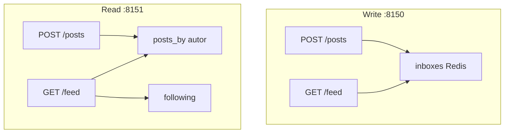

# Tutorial — Lab B: news feed (fan-out write vs read)

**Módulo:** [11 — System Design](README.md) · **Lab:** [lab-feed-fanout/](lab-feed-fanout/)  
**Tempo sugerido:** tecnologia 15 min + lab 90–120 min  
**Pré-requisito:** [teoria.md](teoria.md) · lab A · lab C · ficha News feed em [casos-entrevista.md](casos-entrevista.md)  
**Apoio:** [glossario.md](glossario.md) · [troubleshooting.md](troubleshooting.md)  
**SO:** Linux, macOS e Windows — [como rodar os comandos](../ferramentas/linux-e-windows.md).  
**Próximo:** [tutorial-notificacao-canais.md](tutorial-notificacao-canais.md) (lab D)

> Leia A e B *antes* do Compose. No lab: rode → observe → anote.

**Protagonista:** um feed estilo “seguindo”. `u1` é comum (poucos seguidores); `celeb` tem dezenas; `leitor` segue todo mundo.

---

## Parte A — A tecnologia: empurrar vs puxar

### Em uma frase

**Fan-out on write:** no POST, copie o post para a **inbox** de cada seguidor — GET vira `LRANGE`.  
**Fan-out on read:** no POST, só grave o post do autor — GET **junta** as timelines de quem você segue.

### Box — o que falta para ser um feed “de verdade”

| Já vemos no lab B | Ainda **não** |
|-------------------|---------------|
| Custo de N seguidores no POST (write) | Ranking, ads, ML |
| Custo de N followees no GET (read) | Grafo em dezenas de milhões |
| Worker parado → inbox fria | Kafka, outbox, replay |
| Híbrido conceitual (celeb = pull) | Detecção automática de celebridade |

Pub/sub Redis **não** entra aqui (já no [10](../10-arquitetura/) lab B). Ponte de fila: [01](../01-comunicacao/).

### Vantagens / custos

| | On write (push) | On read (pull) |
|--|-----------------|----------------|
| **Ganha** | GET barato e previsível | POST barato; celebridade não explode a escrita |
| **Paga** | POST proporcional a seguidores; storage de inbox | GET proporcional a following; p99 instável |

### Quando usar (neste lab / entrevista)

- Write: grafo “normal”, leitura muito mais frequente que escrita.  
- Read: celebridades, ou leitura rara.  
- Híbrido: *a* resposta madura — não precisa implementar no lab.

---

## Parte B — Contexto de uso



**Pergunta-guia:** o POST da celebridade dói? o GET de quem segue 40 pessoas dói? *em qual* topologia?

O delay `FANOUT_MS_PER_FOLLOWER=5` é o “custo de rede/IO” comprimido para caber em um exercício — na entrevista você fala em QPS e tamanho do grafo, não nesse 5 ms.

---

## Parte C — Lab

### Subir e semear

```bash
cd sistemas-distribuidos/11-system-design/lab-feed-fanout
./scripts/up.sh
./scripts/seed.sh
./scripts/status.sh
```

**Observe:** `celeb.followers ≈ N` (default 40); `u1.followers` poucos (u2–u4 + quem mais seguir); `leitor.following ≈ N`.

### Exp. 1 — Celebridade no POST

```bash
./scripts/provar-celebridade.sh
```

**Observe:** write + `celeb` → `tempo_ms` centenas; write + `u1` → dezenas; read → ambos rápidos.  
**Interprete:** celebrity problem é **hot key na escrita** ([05](../05-escalabilidade/)). Não “falta Kubernetes”.

### Exp. 2 — Leitor voraz no GET

```bash
./scripts/provar-leitura.sh
```

**Observe:** read + `leitor` → GET lento (merge); write + `leitor` → GET de inbox, estável.  
**Interprete:** você só **moveu** o custo. Entrevista: “quem paga — o autor famoso ou o leitor que segue 5 mil?”

### Exp. 3 — Worker parado (write)

```bash
./scripts/provar-worker.sh
```

**Observe:** POST **202**; feed do seguidor **sem** o post; depois do `start worker`, o post aparece.  
**Interprete:** mesmo desacoplamento do [10](../10-arquitetura/) lab B e das filas do [01](../01-comunicacao/). Consistência **eventual** ([03](../03-consistencia-cap/)) — o wrap-up da entrevista precisa dizer isso em voz alta.

### Exp. 4 — Híbrido no papel (sem Compose extra)

A resposta madura de entrevista é **híbrida**: push para usuários “normais”, pull (fan-out on read) para celebridade. Não implementamos o híbrido no lab — **estime**.

> **Ponte lab → entrevista:** no Compose, `N≈40` seguidores basta para *sentir* o custo (centenas de ms). Na oral você **multiplica** o mesmo desenho (200 vs 10 M). O algoritmo (híbrido) não muda — só a ordem de grandeza.

Premissas (mude se quiser):

- 10 M usuários; 1% são “celebridade” no critério *seguidores > 10k*.  
- Post de usuário comum: média **200** seguidores → push = **200** writes de inbox.  
- Post de celebridade: **10 M** seguidores → push puro = **10 M** writes (ruim).  
- Híbrido: celebridade **não** faz push; followers puxam no GET (custo no leitor que abre o feed).

```text
Writes de inbox por post comum   ≈ 200
Writes de inbox por post celeb (push puro) ≈ 10_000_000
Writes de inbox por post celeb (híbrido)   ≈ 0  (+ custo no GET de quem segue a celeb)
```

**Interprete:** o lab mostrou os *extremos* em escala de brinquedo; a entrevista pede o **meio** com um número. Critério típico: limiar de seguidores ou “QPS do autor”.

---

## Fechamento

No quadro:

1. Escopo: feed de following; ranking fora.  
2. High-level: duas setas — push vs pull; entidades `User`, `Follow`, `Post`, `Inbox`.  
3. Deep dive: celebridade → híbrido (**Exp. 4**).  
4. Wrap-up: worker SPOF; 10× seguidores da celeb; p99 do GET; métrica de profundidade de fila ([09](../09-observabilidade/)).

`docker compose down -v` antes do lab D.
