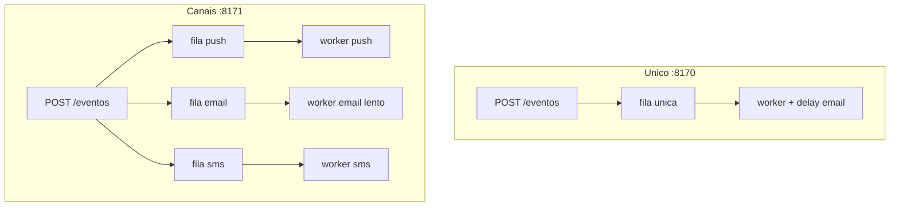

# Tutorial — Lab D: notificação (fila única vs por canal)

**Módulo:** [11 — System Design](README.md) · **Lab:** [lab-notificacao-canais/](lab-notificacao-canais/)  
**Tempo sugerido:** tecnologia 10 min + lab 60–90 min  
**Pré-requisito:** enunciado da ficha Notification (sem abrir a Direção) · lab B · [10](../10-arquitetura/) lab B  
**Apoio:** [glossario.md](glossario.md) · [troubleshooting.md](troubleshooting.md)  
**SO:** Linux, macOS e Windows — [como rodar os comandos](../ferramentas/linux-e-windows.md).  
**Próximo:** [decisoes.md](decisoes.md) (cenário 3) → [mock-entrevista.md](mock-entrevista.md) Mock 1 → **depois** [exemplo-notificacao.md](exemplo-notificacao.md)

> Leia A e B *antes* do Compose.

**Protagonista:** evento “pedido confirmado” gera **push + e-mail + SMS**. O e-mail demora ~2 s (SMTP lento simulado).

---

## Parte A — A tecnologia

### Em uma frase

**Fila única:** um worker processa todos os canais em sequência — job de e-mail lento **atrasa** o push.  
**Filas por canal:** cada canal tem worker — e-mail lento **não** segura o push.

### Box — o que falta

| Já vemos | Ainda **não** |
|----------|---------------|
| Isolamento de lentidão por canal | SMTP/FCM reais, DLQ madura |
| Borda 202 | Outbox / exactly-once |
| Ordem email→push na fila única | Prioridade / scheduling |

### Quando usar

- Por canal: quase sempre em notificação multi-canal (Mock 1).  
- Única: só protótipo com um canal ou carga baixíssima.

---

## Parte B — Contexto



**Pergunta-guia:** o usuário sente o push em menos de 1 s ou espera o SMTP?

---

## Parte C — Lab

### Subir

```bash
cd sistemas-distribuidos/11-system-design/lab-notificacao-canais
./scripts/up.sh
./scripts/status.sh
```

### Exp. 1 — Request feliz

```bash
./scripts/enviar.sh canais
sleep 3
./scripts/status.sh
```

**Observe:** `enviados` sobe em push/email/sms.  
**Interprete:** borda devolve **202**; o trabalho é async ([10](../10-arquitetura/) lab B).

### Exp. 2 — Isolamento

```bash
./scripts/provar-isolamento.sh
```

**Observe:** `tempo_ate_push` no **unico** ~≥ 2000 ms; nos **canais** bem menor.  
**Interprete:** “um worker para três canais” é a armadilha da ficha Notification.

> **Gap honesto:** o lab D prova **isolamento de latência** por canal. **Idempotência** no retry (chave `event_id:canal`) é conceito do Mock 1 / [06](../06-falhas-timeout/) — o Compose não reenvia o mesmo evento duas vezes. Na oral, diga os dois e separe evidência vs quadro.

---

## Fechamento (Mock 1)

1. Escopo: 3 canais; preferências fora do lab.  
2. High-level: 202 + filas **por canal**.  
3. Deep dive: e-mail lento ≠ push lento; idempotência = quadro/[06](../06-falhas-timeout/).  
4. Wrap-up: lag por fila; DLQ (conceito); métrica bounce ([09](../09-observabilidade/)).

`docker compose down -v` ao terminar.
