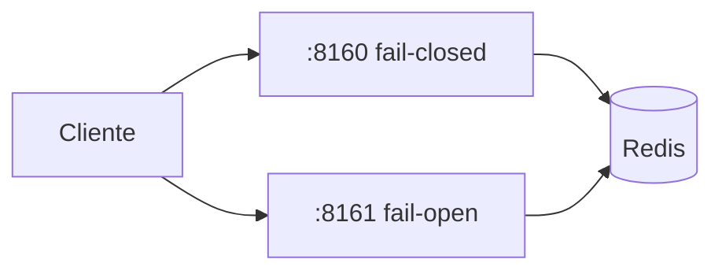

# Tutorial — Lab C: rate limiter (janela fixa; fail-closed vs fail-open)

**Módulo:** [11 — System Design](README.md) · **Lab:** [lab-rate-limiter/](lab-rate-limiter/)  
**Tempo sugerido:** tecnologia 10 min + lab 60–90 min  
**Pré-requisito:** [teoria.md](teoria.md) · lab A · ficha Rate limiter em [casos-entrevista.md](casos-entrevista.md) (enunciado; Direção depois)  
**Apoio:** [glossario.md](glossario.md) · [troubleshooting.md](troubleshooting.md)  
**Próximo:** ficha News feed → [tutorial-feed-fanout.md](tutorial-feed-fanout.md)

> Leia A e B *antes* do Compose. No lab: rode → observe → anote.

**Protagonista:** API pública com cota por chave (`aluno-1`). Limit = **5** pedidos / **10 s**.

---

## Parte A — A tecnologia

### Em uma frase

**Janela fixa (fixed window):** `INCR` + `EXPIRE` na janela — o lab C implementa **isto** (não token bucket).  
**Fail-closed:** sem Redis, a borda **recusa** (**503**) — protege o backend.  
**Fail-open:** sem Redis, a borda **aceita** (**200**) — UX sobe; o backend pode levar abuso.

### Box — o que falta / o que *não* é

| Já vemos no lab C | Ainda **não** (entrevista: diga o nome) |
|-------------------|----------------------------------------|
| Cota → **429** | **Token bucket** (pico curto até esgotar tokens) |
| Fail-open vs closed | **Sliding window** (mais justa, mais cara) |
| Chave por token | Quotas por plano / billing |
| Janela fixa | Armadilha: *edge burst* — 5 no fim da janela + 5 no início da próxima |

Na oral: “no lab usei **fixed window**; em produção eu discutiria token bucket vs sliding window conforme o SLA.”

### Tabela 2×2 — status HTTP

| | Dentro da cota | Estourou a cota |
|--|----------------|-----------------|
| **Redis ok** | **200** | **429** Too Many Requests |
| **Redis down** (closed) | **503** | **503** (limiter indisponível) |
| **Redis down** (open) | **200** fail-open | **200** fail-open |

Não misture: **429 = cota**; **503 = política fail-closed** quando o contador sumiu.

### Quando usar

- Fail-closed: matrícula, pagamento, escrita sensível.  
- Fail-open: leitura pública onde degradar > negar (com monitoramento).  
- Rate limit **protege**; não substitui escala ([05](../05-escalabilidade/)).

---

## Parte B — Contexto



**Pergunta-guia:** no pico do prazo, o Redis do limiter cai — o que a coordenação prefere: 503 ou API aberta sem cota?

---

## Parte C — Lab

### Subir

```bash
cd sistemas-distribuidos/11-system-design/lab-rate-limiter
./scripts/up.sh
./scripts/status.sh
```

### Exp. 1 — Estourar a cota

```bash
./scripts/provar-cota.sh closed
./scripts/provar-cota.sh open
```

**Observe:** ~5× HTTP 200, depois **429**.  
**Interprete:** wrap-up de abuso no encurtador (cenário 1) — rate limit no POST, não “mais pods”.

### Exp. 2 — Redis down

```bash
./scripts/provar-redis-down.sh
```

**Observe:** `:8160` → **503**; `:8161` → **200** com `fail_open`. Pode demorar ~1–2 s (DNS do container parado — artefato Compose, não do algoritmo; ver [troubleshooting.md](troubleshooting.md)).  
**Interprete:** a pergunta da entrevista não é “tem Redis?” — é **qual política** quando o Redis some. Ponte [06](../06-falhas-timeout/).

---

## Fechamento

1. Escopo: limitar por chave; billing fora.  
2. High-level: borda → limiter → API.  
3. Deep dive: fail-open vs closed **e** fixed window vs alternativas.  
4. Wrap-up: Redis SPOF; métrica taxa de 429 ([09](../09-observabilidade/)).

`docker compose down -v` antes do lab B.
