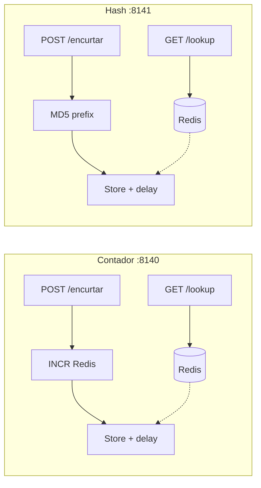

# Tutorial — Lab A: URL shortener

**Módulo:** [11 — System Design](README.md) · **Lab:** [lab-url-shortener/](lab-url-shortener/)  
**Tempo sugerido:** tecnologia 15 min + lab 90–120 min  
**Pré-requisito:** [teoria.md](teoria.md) §1–4 · [00](../00-ambiente-docker/)  
**Apoio:** [glossario.md](glossario.md) · [troubleshooting.md](troubleshooting.md)  
**SO:** Linux, macOS e Windows — [como rodar os comandos](../ferramentas/linux-e-windows.md).  
**Próximo:** [tutorial-rate-limiter.md](tutorial-rate-limiter.md) (lab C) → depois feed

> Leia A e B *antes* do Compose. No lab: rode → observe → anote.

**Protagonista:** um serviço público que troca URL longa por código curto. O GET do redirect é **leitura pesada**; o POST é raro (envelope §3 da teoria).

---

## Parte A — A tecnologia: ID + cache na leitura

### Em uma frase

**Contador:** um `INCR` atômico vira código base62 — único, previsível.  
**Hash truncado:** prefixo de MD5 — curto, **colide** quando o espaço é pequeno.  
**Cache:** o GET não precisa pagar o store toda vez ([07](../07-cache-distribuido/)).

### Box — o que falta para ser encurtador “de verdade”

| Já vemos no lab A | Ainda **não** |
|-------------------|---------------|
| Dois geradores de ID lado a lado | Shard, geo-DNS, HTTPS, analytics |
| Delay no store + Redis na frente | Postgres/Dynamo de produção |
| 301 vs 302 nos headers | Cache do browser real entre alunos |
| Colisão de hash curto | Birthday attack em 64 bits |

Use o termo **aproximação didática**. Na entrevista, o deep dive costuma ser: *como gera o ID* e *como o GET aguenta 100× escrita*.

### Vantagens / custos (lembrete)

| | Contador | Hash truncado |
|--|----------|----------------|
| **Ganha** | Unicidade; código curto e denso | Sem coordenar um sequenciador |
| **Paga** | Precisa de um dono do contador (Redis/SQL) | Colisão; tamanho vs unicidade |

| | Cache no GET | Sem cache |
|--|--------------|-----------|
| **Ganha** | p50/p99 baixos; store vive | Sem stale; um lugar da verdade |
| **Paga** | Invalidação / TTL ([07](../07-cache-distribuido/)) | Cada redirect paga o store |

### Quando usar (neste lab)

- Contador: quando unicidade importa mais que “não ter Redis”.  
- Hash: só se o espaço for **grande** (não 3 hex).  
- 301: destino estável; 302: ainda pode mudar (campanha, A/B).

---

## Parte B — Contexto de uso



**Pergunta-guia:** se o store ficar lento (40 ms), o GET do redirect ainda é usável — *com* e *sem* cache?

Números do envelope (teoria §3): ~40 writes/s vs ~4 000 reads/s. O lab não gera 4k QPS; ele mostra **onde** o milissegundo vai.

---

## Parte C — Lab

### Subir

```bash
cd sistemas-distribuidos/11-system-design/lab-url-shortener
./scripts/up.sh
./scripts/status.sh
```

### Exp. 1 — Request feliz nos dois modos

```bash
./scripts/enviar.sh contador
./scripts/enviar.sh hash
```

**Observe:** o código do contador é **curto e denso** (base62 de um sequencial — `g9`, `ga`…, *não* aleatório); o do hash é hex do tamanho de `hash_chars`.  
**Interprete:** dois desenhos de ID — o entrevistador vai perguntar *qual* e *por quê*.

### Exp. 2 — Leitura: cache vs store lento

```bash
./scripts/medir-leitura.sh contador
```

**Observe:** `p50 cache_on` deve ser bem menor que `p50 cache_off` (`store_hold_ms=40`). A primeira amostra com cache ainda pode ser *miss*.  
**Interprete:** o gargalo da leitura era o store, não o algoritmo do código. Ponte [07](../07-cache-distribuido/) e [05](../05-escalabilidade/) (gargalo **anda**).

### Exp. 3 — 301 vs 302

```bash
./scripts/provar-redirect.sh contador
```

**Observe:** `curl -sI` mostra status e `Cache-Control`.  
**Interprete:** 301 pode **zerar** QPS repetido no *cliente* — e prende você ao destino. 302 deixa o servidor no caminho crítico.

### Exp. 4 — Colisão (hash curto)

```bash
./scripts/provar-colisao.sh
```

**Observe:** `colisoes` no health e `colisao: true` em vários POSTs com `HASH_CHARS=3`.  
**Interprete:** hash truncado **não** substitui um gerador de ID. Vá à ficha unique IDs em [casos-entrevista.md](casos-entrevista.md).

### Exp. 5 — Redis down (contador)

```bash
# rebuild se mudou a API recentemente:
./scripts/up.sh
./scripts/provar-redis-down.sh
```

**Observe:** com Redis parado, `POST` no **contador** falha (precisa do `INCR`); `GET /lookup` de código **já** no store local ainda pode funcionar (cache miss → dict). Hash mode: POST não depende do sequenciador.  
**Interprete:** na entrevista, diga o que acontece se o Redis cair — fail no POST vs GET degradado. Próximo lab C: fail-open vs fail-closed na *borda* do limiter.

### Exp. 6 — Idempotência no POST (opcional, recomendado)

```bash
./scripts/provar-idempotencia.sh
```

**Observe:** mesma URL / mesma `Idempotency-Key` → mesmo código; key reutilizada com URL outra → 409.  
**Interprete:** retry ([06](../06-falhas-timeout/)) não deve criar N links — entra no deep dive / wrap-up do encurtador.

---

## Fechamento

No quadro da entrevista, o encurtador cabe em 4 passos — modelo oral em [exemplo-encurtador.md](exemplo-encurtador.md):

1. Escopo: só encurtar + redirect; analytics fora; **abuso/spam** = rate limit no POST (**lab C** a seguir).  
2. High-level: POST → store; GET → cache → store; entidades + 2 endpoints.  
3. Deep dive: ID (contador vs hash) **ou** cache/301.  
4. Wrap-up: Redis SPOF; 10× reads = mais cache, não mais workers cegos.

`docker compose down -v` antes do lab C.
